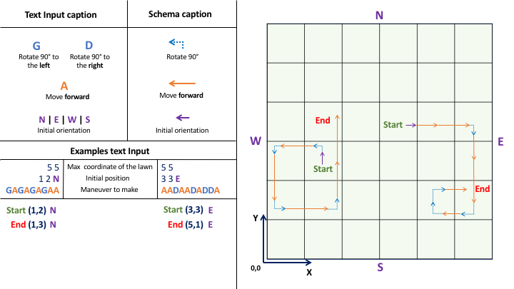

# automatic-lawnmower-for-xebia
Conception of an automatic lawnmower to mow rectangular surfaces. Technical Test for Xebia

## Purpose
Retrieve the final position and orientation of a list of automatic mower based on maneuver to make given by an input file.

## Installation
Clone the repo and execute `mvn package`

## Execution
Jar is in target directory

`java -jar automatic-lawnmower-for-xebia-1.0-SNAPSHOT-jar-with-dependencies.jar <path_to_example_file>`

## Tests
Some test come with associated schema to understand easily what the test actually do.

See comments on the test to retrieve these schema.